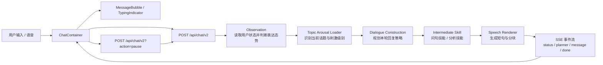

# Focus Chat

> 它不是一个急着给答案的聊天框。  
> 它更像一扇夜里的窗，让人的情绪、犹豫、兴奋和还没想清楚的话，先有地方继续活着。

`Focus Chat` 是一个以“陪伴式思考”而不是“标准化问答”为目标的对话系统 Demo。  
它运行在 `Next.js 16 + React 19 + TypeScript + Tailwind CSS v4` 之上，模型调用走 `OpenAI SDK` 的兼容接口接入 `DeepSeek`，前端以 `SSE` 方式逐条接收回复，语音输入则通过 `BigModel ASR` 转写。

这份 README 既想解释它为什么存在，也想讲清楚它究竟是怎样运行的。

## 项目定位

很多聊天产品试图“更快给答案”。  
`Focus Chat` 反过来，它更关心另一件事:

- 当用户还在想，还没讲完，还处在复杂的自我冲突里，系统能不能不要急着结束这段思路。
- 当用户开始累了、困了、表达意愿下降了，系统能不能不靠说教，而是自然地把认知负荷慢慢放低。

所以它不是一个知识库入口，也不是一个万能建议机。  
它更像一个被工程化实现的“在场者”。

## 设计哲学

### 1. 陪伴不是安抚，而是容纳复杂

这里的目标不是把情绪立刻抚平，而是允许矛盾同时存在。  
用户可以一边兴奋，一边羞耻；一边想逃，一边又想证明自己。系统要做的，不是迅速归类，而是先接住这种张力。

### 2. 跟随用户，不抢夺叙事权

如果用户仍然在一个高认知话题里推进，比如职业分叉、身份冲突、现实与理想的撕裂，系统不应为了显得“温柔”而突然降智。  
真正的温柔，很多时候不是降维解释，而是有能力跟住。

### 3. 系统主动转场时，刺激只能递减

只有当系统主动换话题、收束对话、或者帮助用户降负荷时，才沿着“高刺激 -> 中刺激 -> 低刺激”往下走。  
从观点回到感受，从感受回到身体，从身体回到环境，这是这套系统很重要的节律原则。

### 4. 输出不是一整段话，而是一种节奏

前端收到的不是一大块完成稿，而是一条条短句。  
这不是纯粹的视觉设计，而是对对话节拍的控制: 一句话一个重心，一次输出一个小动作。

### 5. 文艺感不该压过用户

系统允许有气味、有画面、有停顿感。  
但“文艺”只是一种理解方式，不该成为自我表演。语言应该服务于听见用户，而不是盖过用户。

## 体验层一览

- 夜窗式视觉场景，带背景视频与环境音
- 中英双语入口，运行期根据选择切换输出语言
- 文本与语音双输入，语音经后端转写后回填输入框
- 服务端逐条推送消息块，前端像聊天一样一条条落下
- 用户重新输入时，前端会向服务端发送 `pause` 信号，中断当前生成

## 技术栈

- `Next.js 16`：`App Router` + `Route Handlers`
- `React 19.2`：前端交互与客户端状态管理
- `TypeScript 5`：严格类型约束
- `Tailwind CSS v4`：样式系统
- `OpenAI SDK`：通过兼容 `baseURL` 调用 `DeepSeek`
- `BigModel ASR`：语音转文字
- `SSE`：服务端逐事件流式返回
- `node:test`：覆盖部分领域模块的单元测试

## 系统全景



如果只看当前主链路，可以把它理解为四个连续阶段:

1. `observe`：先判断用户此刻的认知活跃度、表达意愿、是否在打断、系统是否太啰嗦。
2. `planDialogue`：再决定这一轮应该跟随、轻问、还是做一点有限分析。
3. `renderSpeech`：把策略翻译成真正要说的话，并切成适合聊天界面的短句。
4. `SSE playback`：最后由前端按事件流逐条展示出来。

## 运行时数据流

### 发送消息

1. 前端在 [`src/components/ChatContainer.tsx`](./src/components/ChatContainer.tsx) 收集 `messages`、当前语言和语音状态。
2. 用户发送后，前端请求 [`src/app/api/chat/v2/route.ts`](./src/app/api/chat/v2/route.ts)。
3. Route Handler 先发出 `thinking` 状态事件，再调用 `observe(...)`。
4. `observe(...)` 会读取 `src/data/user-state.json`，结合最近消息历史生成一份 `ObservationResult`。
5. 服务端读取上一轮对话上下文，调用 `loadTopicArousalContext(...)` 判断当前话题的刺激级别和是否发生主线切换。
6. `planDialogue(...)` 产出本轮 `DialoguePlan`，包括:
   - 当前话题是什么
   - 这轮处在什么阶段
   - 回应模式是 `default`、`ask` 还是 `analyze`
   - 是否需要额外素材检索
7. `buildIntermediateSkillOutput(...)` 根据 `DialoguePlan` 选择技能输出:
   - `question skill`
   - `analysis skill`
   - 或不额外附加技能
8. `renderSpeech(...)` 将策略渲染成真正的回复文本，再切为 `chunks`
9. 后端把 `planner`、`message`、`done` 等事件通过 `SSE` 推给前端
10. 前端将每个 `chunk` 作为单独的 assistant 消息落到聊天区

### 暂停生成

1. 用户重新开始输入时，`MessageInput` 触发 `onInput`
2. 前端向 `/api/chat/v2` 发送 `{ action: "pause" }`
3. 服务端通过当前 `AbortController` 中止正在进行的输出流

这使得“打断”不是 UI 假象，而是后端真正停止了本轮生成。

## 核心分层

| 层级 | 关键文件 | 作用 |
| --- | --- | --- |
| 体验层 | `src/app/page.tsx` `src/components/*` | 聊天舞台、输入框、消息气泡、状态提示、语音录制 |
| 编排层 | `src/app/api/chat/v2/route.ts` | 统一串起观察、规划、表达、SSE 输出与暂停机制 |
| 观察层 | `src/lib/observation/*` | 从消息历史推断用户当下的表达状态，并更新本地状态文件 |
| 规划层 | `src/lib/dialogue-construction/*` | 维护最近轮次摘要、上下文记忆、回复意图和话题推进策略 |
| 表达层 | `src/lib/speech-renderer/*` | 把“应该怎么回应”翻译成短句、语气和发送形态 |
| 话题负荷层 | `src/lib/topic-arousal-loader.ts` | 识别当前话题的认知刺激度，约束系统转场时只能递减 |
| 素材与人格层 | `src/data/soul.md` `src/data/user-profile.md` `src/data/cognitive-state.md` | 规定系统的说话气质、用户画像与补充认知材料 |
| 语音入口 | `src/app/api/transcriptions/route.ts` | 接收前端 WAV 音频，调用 BigModel ASR 返回文本 |
| 支撑层 | `src/lib/logger.ts` `src/types/index.ts` | 日志、类型和共用结构定义 |

## 目录地图

```text
focusChat/
├─ src/
│  ├─ app/
│  │  ├─ layout.tsx
│  │  ├─ page.tsx
│  │  └─ api/
│  │     ├─ chat/
│  │     │  ├─ route.ts
│  │     │  └─ v2/route.ts
│  │     ├─ transcriptions/route.ts
│  │     └─ test/route.ts
│  ├─ components/
│  │  ├─ ChatContainer.tsx
│  │  ├─ MessageInput.tsx
│  │  ├─ MessageBubble.tsx
│  │  └─ TypingIndicator.tsx
│  ├─ data/
│  │  ├─ soul.md
│  │  ├─ user-profile.md
│  │  ├─ cognitive-state.md
│  │  ├─ topic-pool.md
│  │  └─ user-state.json
│  ├─ lib/
│  │  ├─ observation/
│  │  ├─ dialogue-construction/
│  │  ├─ speech-renderer/
│  │  ├─ topic-arousal-loader.ts
│  │  ├─ topic-pool.ts
│  │  └─ logger.ts
│  └─ types/index.ts
├─ next.config.ts
├─ package.json
└─ README.md
```

## 当前最值得读的文件

如果你第一次接手这个项目，推荐按这个顺序读:

1. [`src/app/api/chat/v2/route.ts`](./src/app/api/chat/v2/route.ts)
2. [`src/components/ChatContainer.tsx`](./src/components/ChatContainer.tsx)
3. [`src/lib/observation/index.ts`](./src/lib/observation/index.ts)
4. [`src/lib/dialogue-construction/index.ts`](./src/lib/dialogue-construction/index.ts)
5. [`src/lib/speech-renderer/index.ts`](./src/lib/speech-renderer/index.ts)
6. [`src/lib/topic-arousal-loader.ts`](./src/lib/topic-arousal-loader.ts)
7. [`src/data/soul.md`](./src/data/soul.md)

读完这几处，项目的“世界观”和“主数据流”基本就都接上了。

## 环境要求

- `Node.js 20.9+`
- `npm`
- 一个可用的 `DeepSeek API Key`
- 如果要启用语音转写，再准备一个 `BigModel API Key`

## 本地启动

### 1. 安装依赖

```bash
npm install
```

### 2. 配置环境变量

新建或编辑 `.env.local`:

```bash
DEEPSEEK_API_KEY=sk-xxxxxxxxxxxxxxxx
DEEPSEEK_MODEL=deepseek-v4-flash
BIGMODEL_API_KEY=your-bigmodel-api-key
```

说明:

- `DEEPSEEK_API_KEY` 必填
- `DEEPSEEK_MODEL` 可选，默认是 `deepseek-v4-flash`
- `BIGMODEL_API_KEY` 仅在使用语音输入时需要

### 3. 启动开发环境

```bash
npm run dev
```

### 4. 打开页面

访问 [http://localhost:3000](http://localhost:3000)

## 接口说明

### `POST /api/chat/v2`

主聊天接口，返回 `text/event-stream`

请求体:

```json
{
  "messages": [
    {
      "id": "msg_1",
      "role": "user",
      "content": "我今天有点睡不着",
      "timestamp": 1740000000000
    }
  ],
  "action": "send",
  "language": "zh"
}
```

其中:

- `action` 当前主用值为 `send` 和 `pause`
- `language` 支持 `zh` / `en`

返回事件类型:

- `status`
- `planner`
- `message`
- `done`
- `error`

### `POST /api/transcriptions`

接收前端录下来的 `WAV` 音频文件，调用 BigModel ASR，并返回:

```json
{
  "text": "转写后的文本"
}
```

### `GET /api/test`

用于快速验证 `DeepSeek` 配置与连通性。

## 工程上的诚实边界

这个项目现在更适合被理解为一个“有明确理念的原型系统”，而不是多租户生产服务。

- 当前消息历史保存在前端内存里，刷新页面会丢失
- `dialogue context` 保存在 Node 进程模块级内存中，不是用户隔离的持久会话
- `user-state.json` 是本地文件持久化，适合 Demo，不适合真正并发环境
- `activeControllers` 目前以固定键值 `current` 管理流式中断，默认假设同一时刻主要服务于一个窗口会话
- `DialoguePlan` 已经预留了 `shouldSearchMaterials` 等字段，但外部检索能力还没有真正接入主链路

换句话说，它的“思想骨架”已经很清楚，但“基础设施骨架”还在成长。

## 演进方向

如果继续往前做，这个项目最自然的几条路是:

- 把当前的本地状态与上下文改造成真正的会话级持久化
- 将 `observation -> plan -> render` 的链路做成可评估、可回放的实验流水线
- 把话题检索、材料检索与长期记忆真正接进主流程
- 完成更明确的唤醒状态机，让“高认知跟随”和“低刺激收束”更稳定
- 补齐多用户隔离、鉴权、存储和可观测性

## 一句话总结

`Focus Chat` 想做的，不是“回答得更像 AI”，而是“陪人把一句话继续活下去”。  
它用工程把一种谈话气质固定下来，也让这种气质可以被调试、被拆解、被继续生长。

## License

MIT
